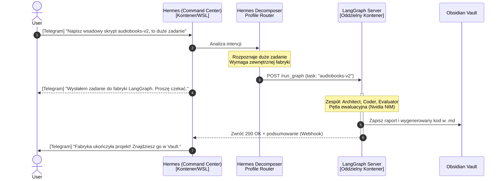

# Architektura Dual-Stack: Hermes + LangGraph

Niniejszy dokument przedstawia wytyczne architektoniczne dla podziału środowiska na dwie współpracujące części:
1. **Frontend / Command Center** (Natywny Hermes)
2. **Backend / Wieloagentowa Fabryka** (LangGraph Server)

## Dlaczego taki podział?
Oba systemy rozwiązują różne problemy:
- **Hermes** doskonale zarządza kanałami wejścia/wyjścia z użytkownikiem (Discord, Telegram), oferuje wbudowaną tablicę Kanban do lekkich zadań, posiada system szybkich profili operacyjnych oraz szybki system notyfikacji.
- **LangGraph** to środowisko inżynieryjne LangChain przeznaczone do tworzenia głębokich, cyklicznych potoków myślowych, budowania sędziów AI, ewaluatorów i wieloagentowych pętli sprzężenia zwrotnego. Nadaje się do zadań wymagających setek operacji w tle, gdzie UI jest niepotrzebny.

## Diagram Komunikacji

Poniższy diagram w formacie Mermaid obrazuje proces zlecania ciężkiego zadania przez użytkownika za pomocą Telegrama.

## Przepływ Informacji
1. **Punkt Wejścia:** Użytkownik kontaktuje się wyłącznie z Hermesem (via Chat lub TUI).
2. **Routing:** Native Decomposer Hermesa decyduje: czy zadanie jest proste (użyj natywnego agenta `coder`) czy złożone (wyślij webhook API do serwera LangGraph).
3. **Ewaluacja Zewnętrzna:** LangGraph Server buduje wewnętrzny graf, uruchamia potężne modele (Llama 3.3, DeepSeek) via NVIDIA API i generuje końcowy, pewny output po ewaluacjach w pętli.
4. **Zapis do Pamięci:** Zewnętrzny kontener ma podmontowany ten sam wolumen bazy wiedzy (Obsidian) co Hermes, by swobodnie wrzucać tam wytworzone artefakty.
5. **Notyfikacja Zwrotna:** LangGraph informuje Hermesa o ukończeniu, a ten pinguje użytkownika na komunikatorze.
